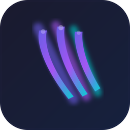

<p align="center">
  
</p>

<h1 align="center">DeskClaw</h1>

<p align="center">
  A secure, cross-platform desktop chat client for <a href="https://github.com/emaspa/openclaw">OpenClaw</a> agents.
</p>

<p align="center">
  <a href="https://github.com/emaspa/deskclaw/releases">Download</a> &middot;
  <a href="#features">Features</a> &middot;
  <a href="#building-from-source">Build</a> &middot;
  <a href="https://buymeacoffee.com/emaspa">Buy me a coffee</a>
</p>

---

## About

DeskClaw is a native desktop application that connects to OpenClaw AI agents over SSH. It provides a modern glassmorphism UI with full chat capabilities, multi-account management, file attachments, voice-to-text, and system tray integration.

Built with **Tauri v2** (Rust backend) and **React 19** (TypeScript frontend).

## Features

**Chat**
- Real-time messaging with markdown rendering (GFM)
- Message queueing when the agent is busy, with auto-send on idle
- File attachments with inline image/audio preview
- Voice-to-text via Web Speech Recognition
- Emoji picker
- Context token usage display

**Connections**
- SSH authentication (password or key-based)
- OpenClaw gateway token auth
- Multi-account management with encrypted credential storage (AES-256-GCM)
- Account profiles with custom avatar and nickname
- Auto-login to last used account

**Desktop**
- System tray with show/hide and quit
- Close-to-tray and minimize-to-tray options
- Custom title bar with native macOS traffic light support
- Cross-platform: Windows, macOS (ARM + Intel), Linux

## Screenshots

<!-- Add screenshots here -->

## Installation

Download the latest release for your platform from the [Releases](https://github.com/emaspa/deskclaw/releases) page:

| Platform | Format |
|----------|--------|
| Windows | `.msi` / `.exe` |
| macOS (Apple Silicon) | `.dmg` |
| macOS (Intel) | `.dmg` |
| Linux | `.deb` / `.AppImage` |

## Building from Source

### Prerequisites

- [Node.js](https://nodejs.org/) 22+
- [Rust](https://rustup.rs/) stable
- Platform-specific dependencies (see below)

**Linux (Ubuntu/Debian):**
```bash
sudo apt install libwebkit2gtk-4.1-dev libappindicator3-dev librsvg2-dev patchelf
```

### Build

```bash
git clone https://github.com/emaspa/deskclaw.git
cd deskclaw
npm install
npm run tauri build
```

The built application will be in `src-tauri/target/release/bundle/`.

### Development

```bash
npm run tauri dev
```

## Tech Stack

| Layer | Technology |
|-------|-----------|
| Framework | [Tauri v2](https://tauri.app/) |
| Frontend | React 19, TypeScript 5.9, Vite 7 |
| State | Zustand 5 (persisted) |
| Backend | Rust, Tokio, russh |
| Crypto | AES-256-GCM, Ed25519, SHA-256 |
| UI | Glassmorphism, Lucide icons, Framer Motion |
| Markdown | react-markdown + remark-gfm |

## Project Structure

```
deskclaw/
├── src/                        # React frontend
│   ├── components/
│   │   ├── chat/               # Chat UI (messages, input, voice, emoji, attachments)
│   │   ├── connection/         # Login screen, account management
│   │   ├── sessions/           # Session list and switching
│   │   ├── layout/             # App shell, sidebar, title bar
│   │   ├── settings/           # Settings dialog
│   │   └── ui/                 # Reusable components (Button, Input, Toggle, etc.)
│   ├── store/                  # Zustand stores (connection, sessions, chat, settings)
│   ├── lib/                    # Types, Tauri wrappers, platform utils
│   └── hooks/                  # Tauri event listeners
├── src-tauri/                  # Rust backend
│   ├── src/
│   │   ├── commands/           # SSH, chat, sessions, settings, crypto commands
│   │   ├── ssh/                # SSH tunnel implementation
│   │   ├── gateway/            # OpenClaw WebSocket protocol
│   │   ├── crypto/             # AES-GCM encryption vault
│   │   └── state/              # App state management
│   └── icons/                  # App icons (all sizes)
└── .github/workflows/          # CI/CD release pipeline
```

## Security

- Passwords, tokens, and key passphrases are encrypted at rest using **AES-256-GCM**
- Encryption key is derived from a per-device identity (Ed25519 + SHA-256)
- Credentials are only decrypted in memory when needed for connection
- SSH key authentication supported with optional passphrase

## License

[GNU General Public License v2.0](LICENSE)

## Support

If you find DeskClaw useful, consider [buying me a coffee](https://buymeacoffee.com/emaspa).
